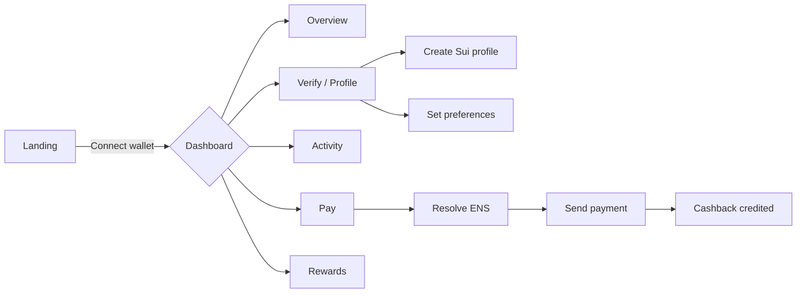
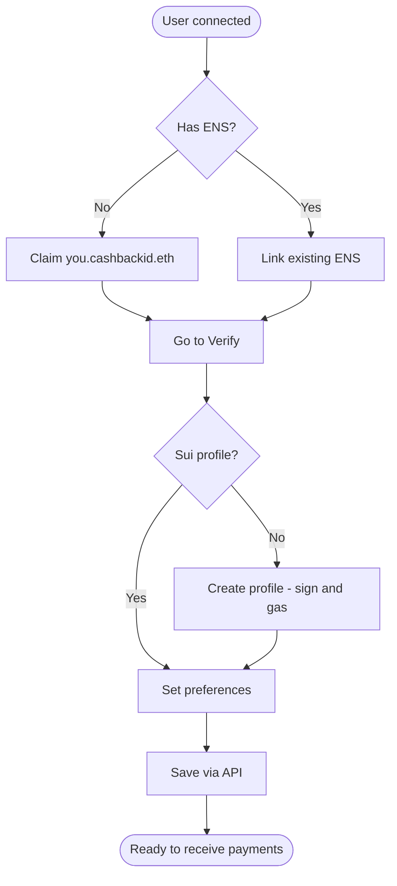
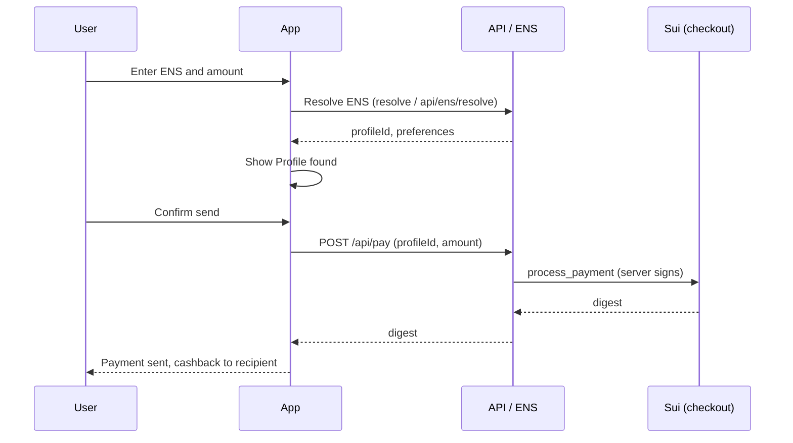
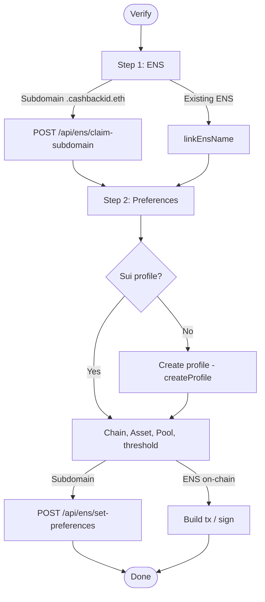

# Cashback ID

**Cross-chain cashback** platform combining **ENS** (identity and payment preferences), **Sui** (profiles and settlement), and **LI.FI** (bridges). Users get a name like `you.cashbackid.eth`, configure how they want to receive payments, and can send or receive cashback in SUI.

---

## Stack

| Layer      | Technology                           |
|-----------|---------------------------------------|
| Frontend  | Next.js 16, React 19, Tailwind CSS    |
| Wallet    | Sui (zkLogin-style), @mysten/dapp-kit |
| Identity  | ENS (resolve, subdomains `.cashbackid.eth`) |
| Backend   | API Routes (claim subdomain, set preferences, pay, create-profile) |
| Blockchain| Sui (testnet/mainnet), Hackmoney-style contract (profile + checkout) |
| Optional  | LI.FI (routes, sweep), Filecoin (proofs) |

---

## Features

- **Landing** → Wallet connect (simulated zkLogin-style flow).
- **Dashboard** → Overview, Pay and Activity tabs, cashback balance in SUI.
- **Free ENS** → Claim `you.cashbackid.eth` (no payment or signing); preferences saved via API.
- **Verify / Profile** → Link existing ENS or use subdomain; create Sui profile; set chain, asset, and pool.
- **Pay** → Resolve ENS (incl. `.cashbackid.eth`), enter amount and send payment; cashback is credited to the recipient’s profile.
- **Receive payments** → Share link `/pay?to=you.cashbackid.eth` so others can pay and cashback goes to your profile.
- **Rewards** → View balance and claim rewards in SUI.
- **Leaderboard** → User ranking (mock data).

---

## Deployed contracts

### Ethereum (mainnet)

| Contract / Role | Address |
|----------------|---------|
| **CashbackIdRegistrar** (subdomains `*.cashbackid.eth`) | [`0x590992a59EB5b989030A75AB8f32d2DFF0c70073`](https://etherscan.io/address/0x590992a59EB5b989030A75AB8f32d2DFF0c70073) |
| cashbackid.eth owner | `0x04BEf5bF293BB01d4946dBCfaaeC9a5140316217` |
| ENS Name Wrapper | `0xD4416b13d2b3a9aBae7AcD5D6C2BbDBE25686401` |
| ENS Public Resolver | `0xF29100983E058B709F3D539b0c765937B804AC15` |

### Sui (testnet default)

| Contract | Address / ID |
|----------|----------------|
| **Move package** (profile + checkout, [GA-Asso/Hackmoney](https://github.com/GA-Asso/Hackmoney)) | `0xbdabfb7fb7822e83b2d8ba86d211347812bb3a6d454f64828ea3c17453f4e9aa` |

Override with `NEXT_PUBLIC_CASHBACK_PACKAGE_ID` in `.env` if you deploy your own package.

---

## Testing the ENS flow

With env vars set (see [Environment variables](#environment-variables)), you can test the full ENS path:

1. **Start the app** — `pnpm dev` and open the dashboard.
2. **Connect a Sui “wallet”** — In this app, **you do not install a Sui Wallet extension**. Click **“Sign In”** or **“Continue with Google”** on the landing (or the wallet button in the header). The app uses a **zkLogin-style** flow: for the current MVP the flow is **simulated** (no real Google OAuth popup). Clicking connect generates a Sui address and saves the session in `localStorage`. You are then “connected” with that address for claiming subdomains, creating a profile, and receiving payments. For on-chain actions (create profile, claim rewards) that address needs SUI for gas on testnet.
3. **Claim a subdomain** — In the dashboard, use “Get my .cashbackid.eth” (optional label, e.g. `alice`). You should see e.g. “Welcome, alice.cashbackid.eth”. If `PRIVATE_KEY` and `ETH_RPC_URL` are set and the wallet has ETH, the name is also registered on-chain (custodial).
4. **Set preferences** — Go to **Verify**, fill chain, asset, pool, and **profileId** (from your Sui profile) so you can receive payments.
5. **Resolve and pay** — In **Pay**, enter `alice.cashbackid.eth` (or your label). The app resolves via `/api/ens/resolve` and you can send a payment to that profile.

**Note:** Locally, data is persisted in `data/ens-store.json`. On serverless (e.g. Vercel) the store is in-memory only unless you add a DB.

---

## User flows (Mermaid)

### 1. General flow: landing to usage



### 2. Onboarding: identity and profile



### 3. Send a payment (Pay)



### 4. Verify and configure profile (Verify)



### 5. High-level architecture


---

## Getting started

### Requirements

- Node.js 18+
- pnpm (recommended) or npm

### Install

```bash
pnpm install
# or
npm install
```

### Environment variables

Copy `.env.example` to `.env.local` and fill in as needed:

```bash
cp .env.example .env.local
```

| Variable | Description |
|----------|-------------|
| `SUI_PRIVATE_KEY` | Server private key (base64) to sign create-profile and pay. |
| `NEXT_PUBLIC_CASHBACK_PACKAGE_ID` | (Optional) Sui Move package ID; defaults to GA-Asso/Hackmoney on testnet. |
| `NEXT_PUBLIC_SUI_NETWORK` | `testnet` or `mainnet`. |
| `NEXT_PUBLIC_ETH_RPC_URL` | (Optional) Ethereum RPC for ENS resolution. |

For **Pay** to work, the wallet for `SUI_PRIVATE_KEY` must have enough SUI for gas.

### Development

```bash
pnpm dev
# or
npm run dev
```

Open [http://localhost:3000](http://localhost:3000).

### Build

```bash
pnpm build
pnpm start
```

---

## Project structure

```
├── app/
│   ├── page.tsx              # Landing
│   ├── layout.tsx
│   ├── dashboard/            # Dashboard (Overview, Pay, Activity)
│   ├── verify/               # Profile / ENS / preferences
│   ├── pay/                  # Pay page (ENS + amount)
│   ├── rewards/              # Claim rewards
│   ├── leaderboard/
│   └── api/                  # claim-subdomain, set-preferences, resolve, create-profile, pay
├── components/               # UI and layout (Header, BottomNav, AppShell, etc.)
├── lib/                      # web3-providers, sui-client, ens-resolver, ens-subdomain-store, api-validate, etc.
├── docs/                     # IMPLEMENTATION_PLAN, MVP_CHECKLIST, ENS_CUSTOM_TEXT_RECORDS_AND_SUBDOMAINS
├── .env.example
└── README.md
```

---

## Further documentation

- [docs/MVP_CHECKLIST.md](docs/MVP_CHECKLIST.md) — MVP status and requirements for end-to-end flow.
- [docs/IMPLEMENTATION_PLAN.md](docs/IMPLEMENTATION_PLAN.md) — Implementation plan and Sui contract usage (Hackmoney).
- [docs/ENS_CUSTOM_TEXT_RECORDS_AND_SUBDOMAINS.md](docs/ENS_CUSTOM_TEXT_RECORDS_AND_SUBDOMAINS.md) — ENS records and `.cashbackid.eth` subdomains.

---

## License

Private project.
