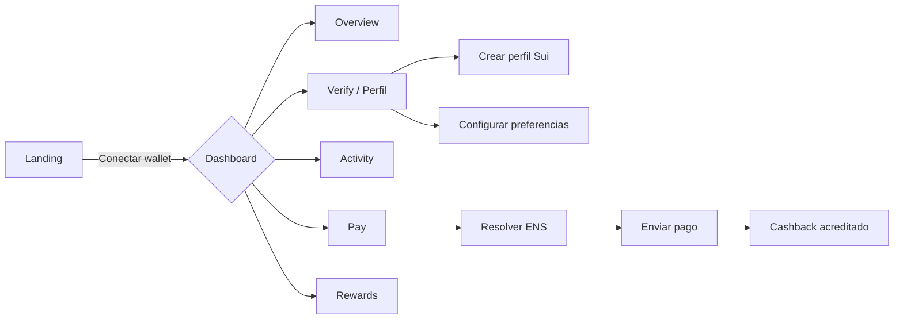
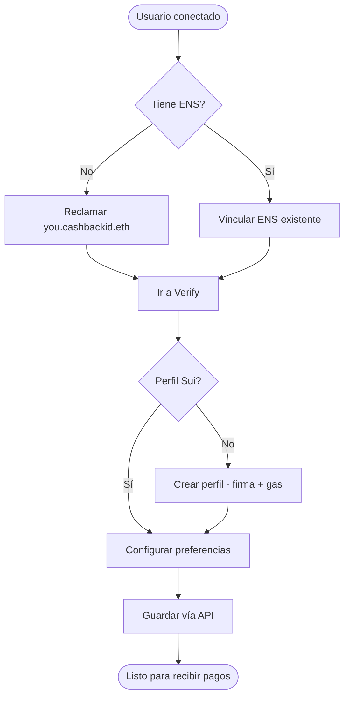
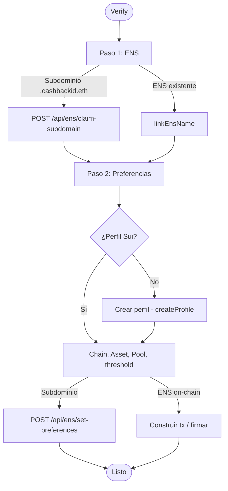
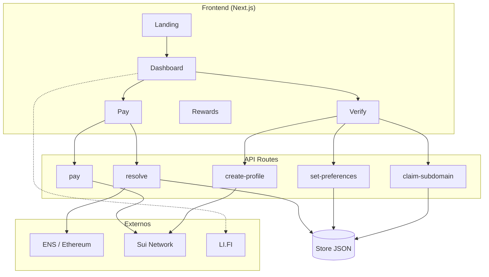

# Cashback ID

Plataforma de **cashback cross-chain** que combina **ENS** (identidad y preferencias de pago), **Sui** (perfiles y liquidación) y **LI.FI** (bridges). Los usuarios obtienen un nombre tipo `you.cashbackid.eth`, configuran cómo quieren recibir pagos y pueden enviar/recibir cashback en SUI.

---

## Stack

| Capa        | Tecnología                          |
|------------|--------------------------------------|
| Frontend   | Next.js 16, React 19, Tailwind CSS   |
| Wallet     | Sui (zkLogin-style), @mysten/dapp-kit |
| Identidad  | ENS (resolve, subdominios `.cashbackid.eth`) |
| Backend    | API Routes (claim subdomain, set preferences, pay, create-profile) |
| Blockchain | Sui (testnet/mainnet), contrato tipo Hackmoney (profile + checkout) |
| Opcional   | LI.FI (rutas, sweep), Filecoin (proofs) |

---

## Características

- **Landing** → Conexión con wallet (flujo tipo zkLogin simulado).
- **Dashboard** → Resumen, pestañas Pay y Activity, balance cashback en SUI.
- **ENS gratuito** → Reclamar `you.cashbackid.eth` (sin pago ni firma); preferencias guardadas vía API.
- **Verify / Perfil** → Vincular ENS existente o usar subdominio; crear perfil en Sui; definir chain, asset y pool.
- **Pay** → Resolver ENS (incl. `.cashbackid.eth`), indicar monto y enviar pago; el cashback se acredita al perfil del destinatario.
- **Recibir pagos** → Compartir enlace `/pay?to=you.cashbackid.eth` para que terceros paguen y el cashback llegue a tu perfil.
- **Rewards** → Ver balance y reclamar recompensas en SUI.
- **Leaderboard** → Ranking de usuarios (datos mock).

---

## Flujos del usuario (Mermaid)

### 1. Flujo general: de la landing al uso



### 2. Onboarding: identidad y perfil



### 3. Enviar un pago (Pay)

```mermaid
sequenceDiagram
  participant U as Usuario
  participant App as App
  participant API as API / ENS
  participant Sui as Sui (checkout)

  U->>App: Introduce ENS + monto
  App->>API: Resolver ENS (resolve / api/ens/resolve)
  API-->>App: profileId, preferencias
  App->>App: Muestra "Perfil encontrado"
  U->>App: Confirmar envío
  App->>API: POST /api/pay (profileId, amount)
  API->>Sui: process_payment (servidor firma)
  Sui-->>API: digest
  API-->>App: digest
  App-->>U: "Pago enviado"; cashback al destinatario
```

### 4. Verificar y configurar perfil (Verify)



### 5. Arquitectura de alto nivel



---

## Cómo ejecutar el proyecto

### Requisitos

- Node.js 18+
- pnpm (recomendado) o npm

### Instalación

```bash
pnpm install
# o
npm install
```

### Variables de entorno

Copia `.env.example` a `.env.local` y rellena lo necesario:

```bash
cp .env.example .env.local
```

| Variable | Descripción |
|----------|-------------|
| `SUI_PRIVATE_KEY` | Clave privada del servidor (base64) para firmar create-profile y pay. |
| `NEXT_PUBLIC_CASHBACK_PACKAGE_ID` | (Opcional) ID del package Move en Sui; por defecto se usa el de GA-Asso/Hackmoney en testnet. |
| `NEXT_PUBLIC_SUI_NETWORK` | `testnet` o `mainnet`. |
| `NEXT_PUBLIC_ETH_RPC_URL` | (Opcional) RPC de Ethereum para resolver ENS. |

Para que **Pay** funcione, la wallet asociada a `SUI_PRIVATE_KEY` debe tener SUI suficiente para gas.

### Desarrollo

```bash
pnpm dev
# o
npm run dev
```

Abre [http://localhost:3000](http://localhost:3000).

### Build

```bash
pnpm build
pnpm start
```

---

## Estructura del proyecto

```
├── app/
│   ├── page.tsx              # Landing
│   ├── layout.tsx
│   ├── dashboard/            # Dashboard (Overview, Pay, Activity)
│   ├── verify/               # Perfil / ENS / preferencias
│   ├── pay/                  # Página de pago (ENS + monto)
│   ├── rewards/              # Reclamar recompensas
│   ├── leaderboard/
│   └── api/                  # claim-subdomain, set-preferences, resolve, create-profile, pay
├── components/               # UI y layout (Header, BottomNav, AppShell, etc.)
├── lib/                      # web3-providers, sui-client, ens-resolver, ens-subdomain-store, api-validate, etc.
├── docs/                     # IMPLEMENTATION_PLAN, MVP_CHECKLIST, ENS_CUSTOM_TEXT_RECORDS_AND_SUBDOMAINS
├── .env.example
└── README.md
```

---

## Documentación adicional

- [docs/MVP_CHECKLIST.md](docs/MVP_CHECKLIST.md) — Estado del MVP y requisitos para que funcione end-to-end.
- [docs/IMPLEMENTATION_PLAN.md](docs/IMPLEMENTATION_PLAN.md) — Plan de implementación y uso del contrato Sui (Hackmoney).
- [docs/ENS_CUSTOM_TEXT_RECORDS_AND_SUBDOMAINS.md](docs/ENS_CUSTOM_TEXT_RECORDS_AND_SUBDOMAINS.md) — Registros ENS y subdominios `.cashbackid.eth`.

---

## Licencia

Proyecto privado.
