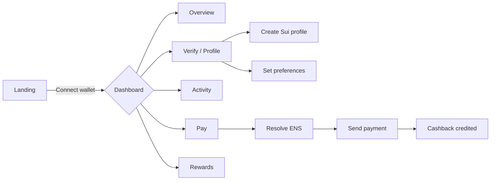
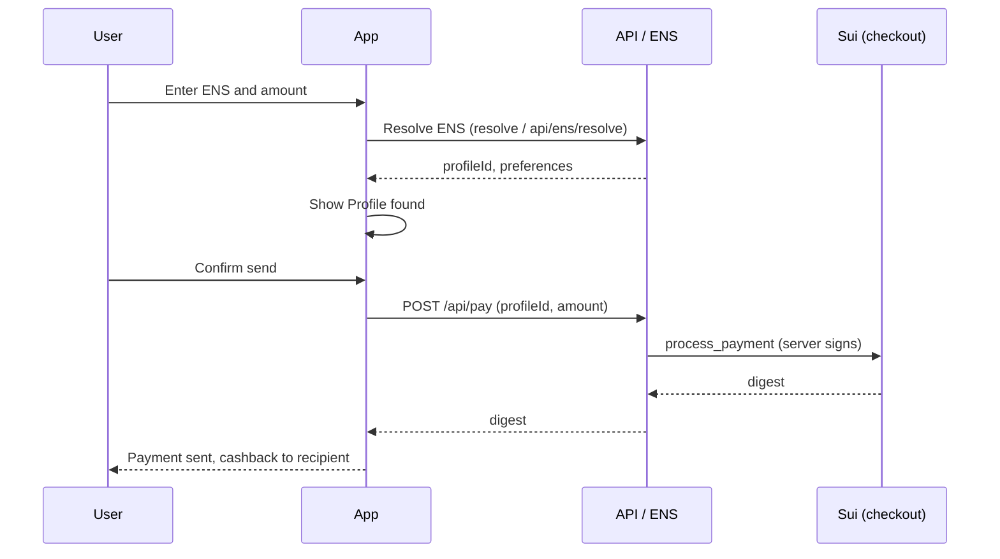

# Cashback ID

**Cross-chain cashback** platform combining **ENS** (identity and payment preferences), **Sui** (profiles and settlement), and **LI.FI** (bridges). Users get a name like `you.cashbackid.eth`, configure how they want to receive payments, and can send or receive cashback in SUI.

---

## Stack

| Layer      | Technology                           |
|-----------|---------------------------------------|
| Frontend  | Next.js 16, React 19, Tailwind CSS    |
| Wallet    | Sui (zkLogin-style), @mysten/dapp-kit |
| Identity  | ENS (resolve, subdomains `.cashbackid.eth`) |
| Backend   | API Routes (claim subdomain, set preferences, pay, create-profile) |
| Blockchain| Sui (testnet/mainnet), Hackmoney-style contract (profile + checkout) |
| Optional  | LI.FI (routes, sweep), Filecoin (proofs) |

---

## Features

- **Landing** → Wallet connect (simulated zkLogin-style flow).
- **Dashboard** → Overview, Pay and Activity tabs, cashback balance in SUI.
- **Free ENS** → Claim `you.cashbackid.eth` (no payment or signing); preferences saved via API.
- **Verify / Profile** → Link existing ENS or use subdomain; create Sui profile; set chain, asset, and pool.
- **Pay** → Resolve ENS (incl. `.cashbackid.eth`), enter amount and send payment; cashback is credited to the recipient’s profile.
- **Receive payments** → Share link `/pay?to=you.cashbackid.eth` so others can pay and cashback goes to your profile.
- **Rewards** → View balance and claim rewards in SUI.
- **Leaderboard** → User ranking (mock data).

---

## Deployed contracts

### Ethereum (mainnet)

| Contract / Role | Address |
|----------------|---------|
| **CashbackIdRegistrar** (subdomains `*.cashbackid.eth`) | [`0x590992a59EB5b989030A75AB8f32d2DFF0c70073`](https://etherscan.io/address/0x590992a59EB5b989030A75AB8f32d2DFF0c70073) |
| cashbackid.eth owner | `0x04BEf5bF293BB01d4946dBCfaaeC9a5140316217` |
| ENS Name Wrapper | `0xD4416b13d2b3a9aBae7AcD5D6C2BbDBE25686401` |
| ENS Public Resolver | `0xF29100983E058B709F3D539b0c765937B804AC15` |

### Sui (testnet default)

| Contract | Address / ID |
|----------|----------------|
| **Move package** (profile + checkout, [GA-Asso/Hackmoney](https://github.com/GA-Asso/Hackmoney)) | `0xbdabfb7fb7822e83b2d8ba86d211347812bb3a6d454f64828ea3c17453f4e9aa` |

Override with `NEXT_PUBLIC_CASHBACK_PACKAGE_ID` in `.env` if you deploy your own package.

---

## Sui and LI.FI: implementation and how they work in the app

### Sui

Sui is used for **identity (profiles)** and **cashback settlement**: balances, receiving payments, and claiming rewards.

| Piece | Where it lives | What it does |
|-------|----------------|---------------|
| **zkLogin-style connect** | `lib/sui-client.tsx` | Simulated flow: "Sign In" / "Continue with Google" derives a Sui address (no real OAuth in MVP), persists session in `localStorage`. In production you’d plug the real zkLogin (OAuth → JWT → prover → sign). |
| **Sui client** | `lib/sui-client.tsx` | `getSuiClient()` uses `NEXT_PUBLIC_SUI_NETWORK` and optional `NEXT_PUBLIC_SUI_RPC_URL`. Used for balance, owned objects, and transaction execution. |
| **Cashback balance** | `lib/sui-client.tsx` → `getCashbackBalance()` | Reads objects owned by the user from the cashback package and sums the `balance` field. Shown in the dashboard and refreshed on mount and when the tab becomes visible again. |
| **Profile (create)** | `lib/sui-client.tsx` → `createProfile()` | Calls Move `profile::create_and_transfer_to_sender`; user signs with their keypair. Returns the new profile object ID. |
| **Profile ID for Pay** | `lib/sui-client.tsx` → `getProfileId()` | Finds the user’s `CashbackProfile` object ID so ENS resolve can return it for payments. |
| **Pay (receive cashback)** | `app/api/pay/route.ts` | `POST /api/pay` with `profileId` and `amount`. Server uses `SUI_PRIVATE_KEY` and calls Move `checkout::process_payment(profile, coin, merchant)`. The recipient’s cashback balance on Sui is credited. |
| **Claim rewards** | `lib/sui-client.tsx` + `/rewards` | User can claim accumulated cashback from their profile on Sui (Move call from the app). |

**Flow in the app:** Connect (zkLogin-style) → claim/link ENS → create Sui profile in Verify → set preferences (chain, asset, pool) → others pay to your ENS → backend runs `process_payment` on Sui → your cashback balance increases. You see the balance in the dashboard and can refresh it or claim rewards from the Rewards page.

### LI.FI

LI.FI is used for **cross-chain routing**: when cashback exists on another chain (e.g. USDC on Base), the app can suggest a route to the user’s preferred chain/asset (e.g. Sui) and show a “Ver ruta” (view route) action.

| Piece | Where it lives | What it does |
|-------|----------------|---------------|
| **Preferences** | ENS text records | `cashbackid.chain`, `cashbackid.asset`, `cashbackid.pool`, and optional threshold. Resolved in `lib/ens-resolver.ts` and passed into LI.FI as destination chain/token. |
| **Build route** | `lib/lifi-client.ts` → `buildCashbackRoute()` | Uses `@lifi/sdk` `getRoutes()`: source chain + token + amount → destination chain + token (from preferences). Returns route, estimated output, gas cost, time, and a summary string. |
| **Quote** | `lib/lifi-client.ts` → `getCashbackQuote()` | Optional path using `getQuote()` for a single cross-chain quote. |
| **Transfer status** | `lib/lifi-client.ts` → `checkTransferStatus()` | Given `txHash`, `fromChainId`, `toChainId`, returns status (PENDING, DONE, FAILED, etc.) from LI.FI. |
| **Omnipin sweep** | `lib/lifi-client.ts` → `evaluateOmnipinSweep()` | Takes a list of balances per chain (chainId, tokenAddress, amount, amountUSD), user address, and preferences. For each balance: if already on preferred chain or below threshold (default $10), marks “no sweep”; otherwise builds a LI.FI route and marks “Ready to sweep”. |
| **Dashboard** | `app/dashboard/dashboard-content.tsx` | Calls `checkSweep(balances)` (today with mock balances; can be replaced with real per-chain balances). For each result “Ready to sweep”, shows “Ver ruta”; clicking opens a dialog with route summary, estimated output, gas, time, and link to [li.fi](https://li.fi). |
| **Wallet context** | `lib/web3-providers.tsx` | Exposes `getClaimRoute(sourceChainId, sourceTokenAddress, amount)` and `checkSweep(balances)` so the dashboard (and any future sweep UI) can build routes and evaluate sweep without calling LI.FI directly. |

**Flow in the app:** User has ENS preferences (e.g. “receive on Sui”). Dashboard shows an “Omnipin sweep” card: for each chain where the user has balance above the threshold, LI.FI is asked for a route to the preferred chain. If a route exists, the row shows “Ready to sweep” and “Ver ruta” opens a modal with details and a link to LI.FI to execute the bridge. Execution is done on LI.FI’s site; the app only displays the route and link.

### Summary

- **Sui**: Profiles, balance, Pay (server signs `process_payment`), claim rewards. Balance refreshes on load and when the tab is focused; optional refresh button in the dashboard.
- **LI.FI**: Routes from any supported chain/token to the user’s preferred chain/token (from ENS). Used in the dashboard for “Omnipin sweep” and “View route”. No execution in-app; user follows the link to LI.FI to perform the transfer.

---

## Code locations: Sui, LI.FI, ENS

Where to find each integration in the repo.

### Sui

| Path | Purpose |
|------|---------|
| `lib/sui-client.tsx` | Sui provider, `getSuiClient()`, zkLogin-style `connectWithZkLogin`, `getCashbackBalance()`, `getProfileId()`, `createProfile()`, `claimRewards()`, `refreshBalance()`. |
| `lib/sui-server.ts` | Server-side Sui client and keypair from `SUI_PRIVATE_KEY` (used by API routes). |
| `app/api/pay/route.ts` | `POST /api/pay`: builds and executes Move `checkout::process_payment(profile, coin, merchant)` on Sui. |
| `app/api/create-profile/route.ts` | `POST /api/create-profile`: optional server-side profile creation. |
| `app/dashboard/dashboard-content.tsx` | Uses `useSui()`, displays cashback balance, refresh button, link to Rewards. |
| `app/rewards/page.tsx` | Claim rewards UI; calls Sui to claim from profile. |
| `app/verify/page.tsx` | “Create profile” (Sui), profile ID field; reads `getProfileId()` for preferences. |

### LI.FI

| Path | Purpose |
|------|---------|
| `lib/lifi-client.ts` | `buildCashbackRoute()`, `getCashbackQuote()`, `checkTransferStatus()`, `evaluateOmnipinSweep()`, `TOKEN_ADDRESSES`, types (`CashbackRoute`, `OmnipinSweepResult`). Uses `@lifi/sdk` (`getRoutes`, `getQuote`, `getStatus`). |
| `lib/web3-providers.tsx` | Wallet context: `getClaimRoute()`, `checkSweep()` (wrap `buildCashbackRoute` and `evaluateOmnipinSweep`). |
| `app/dashboard/dashboard-content.tsx` | Omnipin sweep card: `checkSweep(MOCK_BALANCES)`, “View route” button, dialog with route summary and link to li.fi. |

### ENS

| Path | Purpose |
|------|---------|
| `lib/ens-resolver.ts` | `resolvePaymentPreferences(name)`: resolves ENS (Public Resolver + app store), returns `profileId`, `suiAddress`, `chainId`, `asset`, `pool`, `threshold`. `CashbackPreferences` type, `SUPPORTED_CHAINS`, `SUPPORTED_ASSETS`, `isCashbackIdSubdomain()`. |
| `lib/ens-subdomain-store.ts` | In-memory store for `*.cashbackid.eth`: `claimSubdomain()`, `setPreferences()`, `getByEnsName()`, `getByLabel()`, `isLabelAvailable()`. Persists to `data/ens-store.json` when configured. |
| `lib/ens-registrar-server.ts` | On-chain registration: `registerSubdomainOnChain(label)`, `getRegistrarStatus()`. Uses CashbackIdRegistrar + Name Wrapper (Ethereum). |
| `app/api/ens/resolve/route.ts` | `GET /api/ens/resolve?name=...`: returns profileId, suiAddress, preferences (for subdomains from store + on-chain ENS when applicable). |
| `app/api/ens/claim-subdomain/route.ts` | `POST /api/ens/claim-subdomain`: claim `label.cashbackid.eth`, optional on-chain registration. |
| `app/api/ens/set-preferences/route.ts` | `POST /api/ens/set-preferences`: save chain, asset, pool, threshold, profileId, suiAddress for a subdomain. |
| `app/api/ens/register-onchain/route.ts` | `POST /api/ens/register-onchain`: register an already-claimed subdomain on Ethereum. |
| `app/api/ens/registrar-status/route.ts` | `GET /api/ens/registrar-status`: config status for on-chain registration (no secrets). |
| `app/verify/page.tsx` | Link ENS, set preferences form, build tx for non-subdomain ENS (Public Resolver). |
| `app/dashboard/dashboard-content.tsx` | Claim subdomain UI, payment link (ENS name), Pay tab (resolve ENS before paying). |
| `app/pay/page.tsx` | Resolve ENS (subdomain via `/api/ens/resolve`, other via `resolvePaymentPreferences`), show profile and send payment. |

---

## Testing the ENS flow

With env vars set (see [Environment variables](#environment-variables)), you can test the full ENS path:

1. **Start the app** — `pnpm dev` and open the dashboard.
2. **Connect a Sui “wallet”** — In this app, **you do not install a Sui Wallet extension**. Click **“Sign In”** or **“Continue with Google”** on the landing (or the wallet button in the header). The app uses a **zkLogin-style** flow: for the current MVP the flow is **simulated** (no real Google OAuth popup). Clicking connect generates a Sui address and saves the session in `localStorage`. You are then “connected” with that address for claiming subdomains, creating a profile, and receiving payments. For on-chain actions (create profile, claim rewards) that address needs SUI for gas on testnet.
3. **Claim a subdomain** — In the dashboard, use “Get my .cashbackid.eth” (optional label, e.g. `alice`). You should see e.g. “Welcome, alice.cashbackid.eth”. If `PRIVATE_KEY` and `ETH_RPC_URL` are set and the wallet has ETH, the name is also registered on-chain (custodial).
4. **Set preferences** — Go to **Verify**, fill chain, asset, pool, and **profileId** (from your Sui profile) so you can receive payments.
5. **Resolve and pay** — In **Pay**, enter `alice.cashbackid.eth` (or your label). The app resolves via `/api/ens/resolve` and you can send a payment to that profile.

**Note:** Locally, data is persisted in `data/ens-store.json`. On serverless (e.g. Vercel) the store is in-memory only unless you add a DB.

---

## User flows (Mermaid)

### 1. General flow: landing to usage



### 2. Onboarding: identity and profile


### 3. Send a payment (Pay)



### 4. Verify and configure profile (Verify)


### 5. High-level architecture


---

## Getting started

### Requirements

- Node.js 18+
- pnpm (recommended) or npm

### Install

```bash
pnpm install
# or
npm install
```

### Environment variables

Copy `.env.example` to `.env.local` and fill in as needed:

```bash
cp .env.example .env.local
```

| Variable | Description |
|----------|-------------|
| `SUI_PRIVATE_KEY` | Server private key (base64) to sign create-profile and pay. |
| `NEXT_PUBLIC_CASHBACK_PACKAGE_ID` | (Optional) Sui Move package ID; defaults to GA-Asso/Hackmoney on testnet. |
| `NEXT_PUBLIC_SUI_NETWORK` | `testnet` or `mainnet`. |
| `NEXT_PUBLIC_ETH_RPC_URL` | (Optional) Ethereum RPC for ENS resolution. |

For **Pay** to work, the wallet for `SUI_PRIVATE_KEY` must have enough SUI for gas.

### Development

```bash
pnpm dev
# or
npm run dev
```

Open [http://localhost:3000](http://localhost:3000).

### Build

```bash
pnpm build
pnpm start
```

---

## Project structure

```
├── app/
│   ├── page.tsx              # Landing
│   ├── layout.tsx
│   ├── dashboard/            # Dashboard (Overview, Pay, Activity)
│   ├── verify/               # Profile / ENS / preferences
│   ├── pay/                  # Pay page (ENS + amount)
│   ├── rewards/              # Claim rewards
│   ├── leaderboard/
│   └── api/                  # claim-subdomain, set-preferences, resolve, create-profile, pay
├── components/               # UI and layout (Header, BottomNav, AppShell, etc.)
├── lib/                      # web3-providers, sui-client, ens-resolver, ens-subdomain-store, api-validate, etc.
├── docs/                     # IMPLEMENTATION_PLAN, MVP_CHECKLIST, ENS_CUSTOM_TEXT_RECORDS_AND_SUBDOMAINS
├── .env.example
└── README.md
```

---

## Further documentation

- [docs/HACKATHON_DEMO_SUI_LIFI.md](docs/HACKATHON_DEMO_SUI_LIFI.md) — **How to test and demonstrate Sui + LI.FI for the hackathon** (judges, checklist, flows).
- [docs/MVP_CHECKLIST.md](docs/MVP_CHECKLIST.md) — MVP status and requirements for end-to-end flow.
- [docs/IMPLEMENTATION_PLAN.md](docs/IMPLEMENTATION_PLAN.md) — Implementation plan and Sui contract usage (Hackmoney).
- [docs/ENS_CUSTOM_TEXT_RECORDS_AND_SUBDOMAINS.md](docs/ENS_CUSTOM_TEXT_RECORDS_AND_SUBDOMAINS.md) — ENS records and `.cashbackid.eth` subdomains.

---

## License

Private project.
